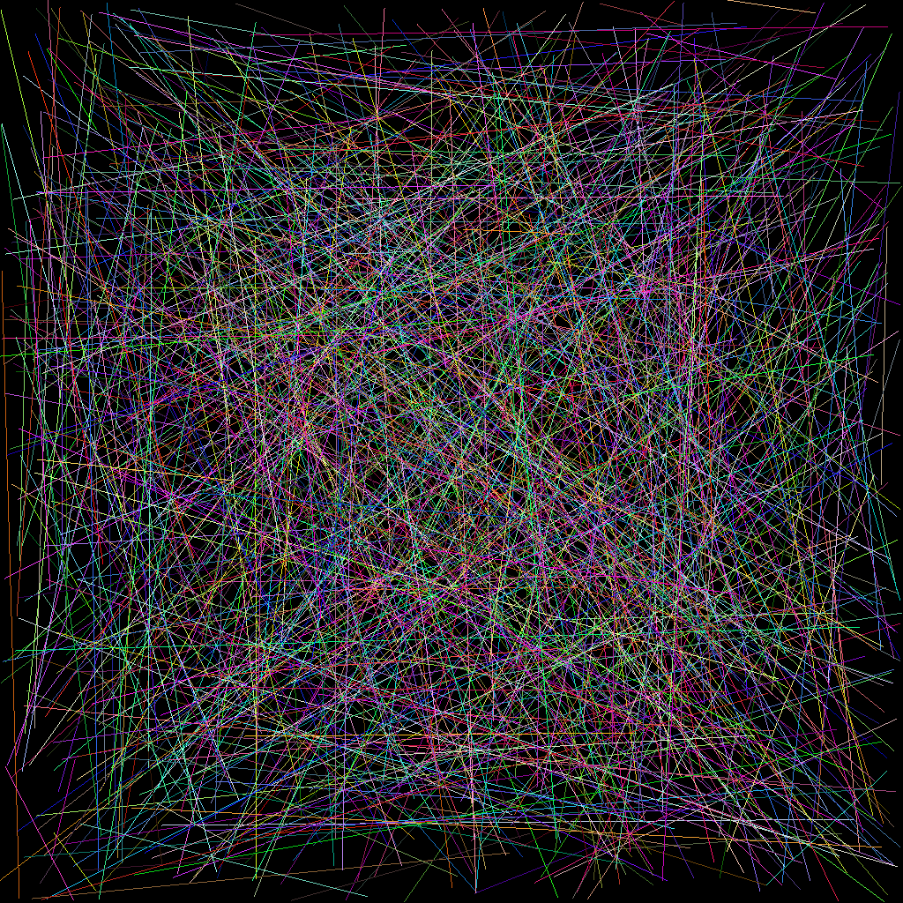
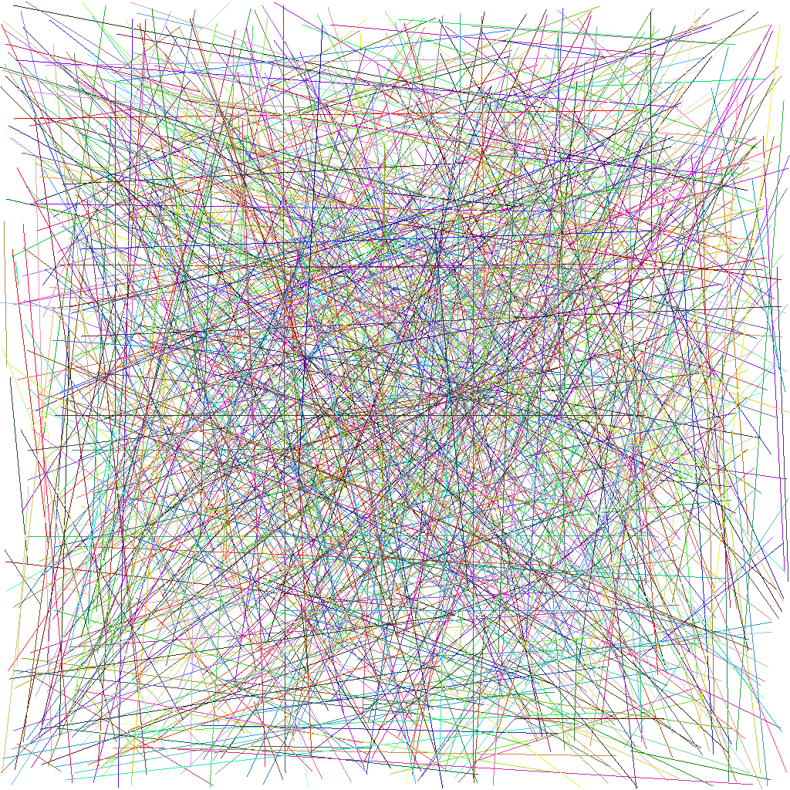

# TinyRaster




## A small custom software rasterizer built from scratch using C++

### Features
- A custom implementation for **framebuffer** which supports **clearing framebuffer with a color**, **point plotting on framebuffer**, and **line rasterization**
- Output is directly written to a PPM file

### Further Developments
- Working on more features for making it into a **full-fledged software renderer**

## Running TinyRaster
```
git clone https://github.com/AayushBade14/TinyRaster.git
cd TinyRaster
mkdir Build
cd Build
cmake ..
cmake --build .
./tr
```
