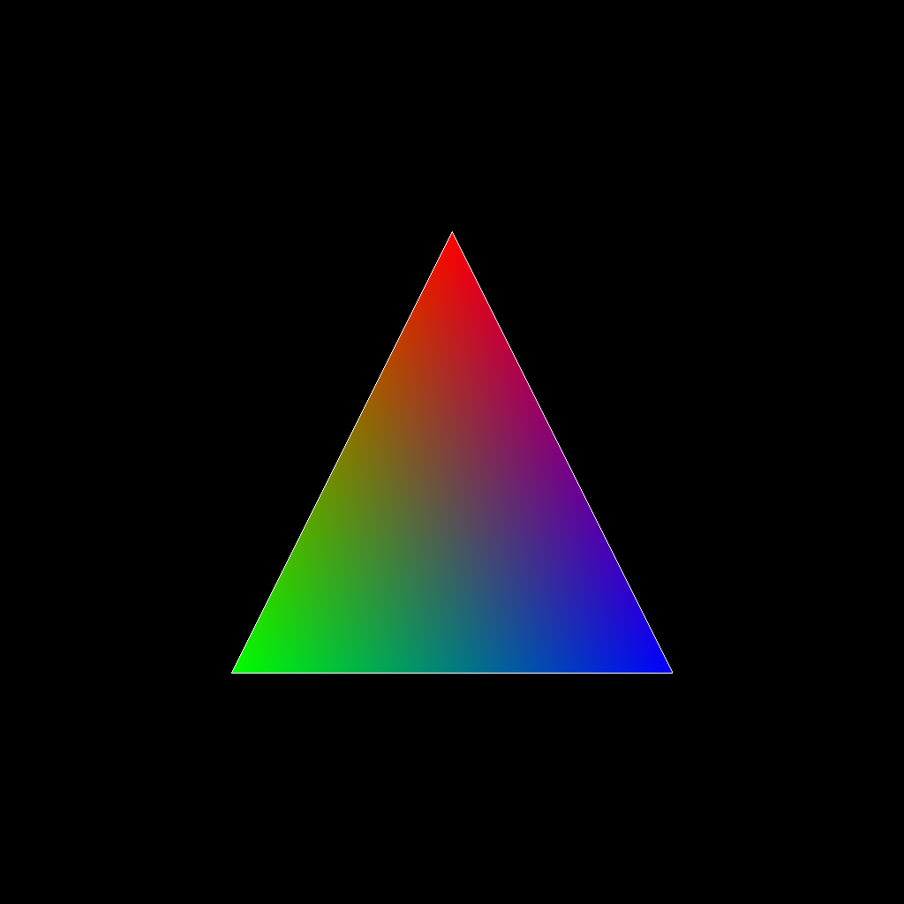
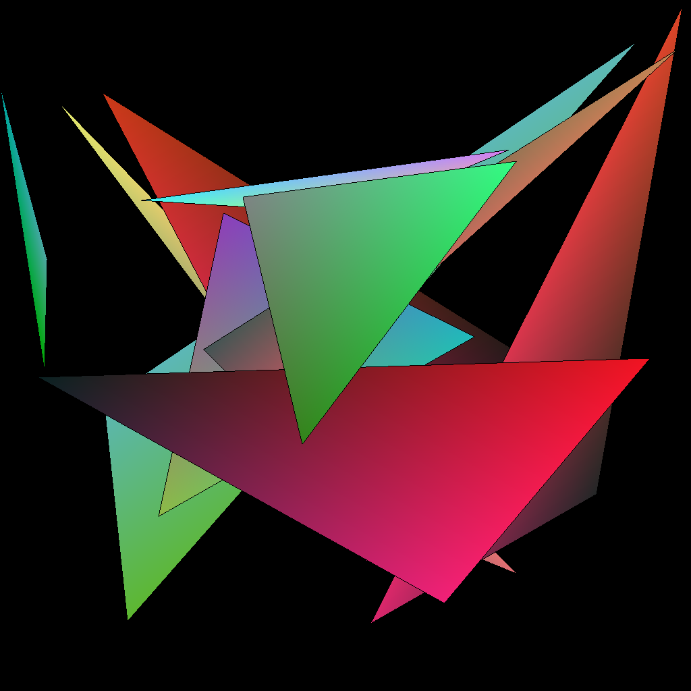
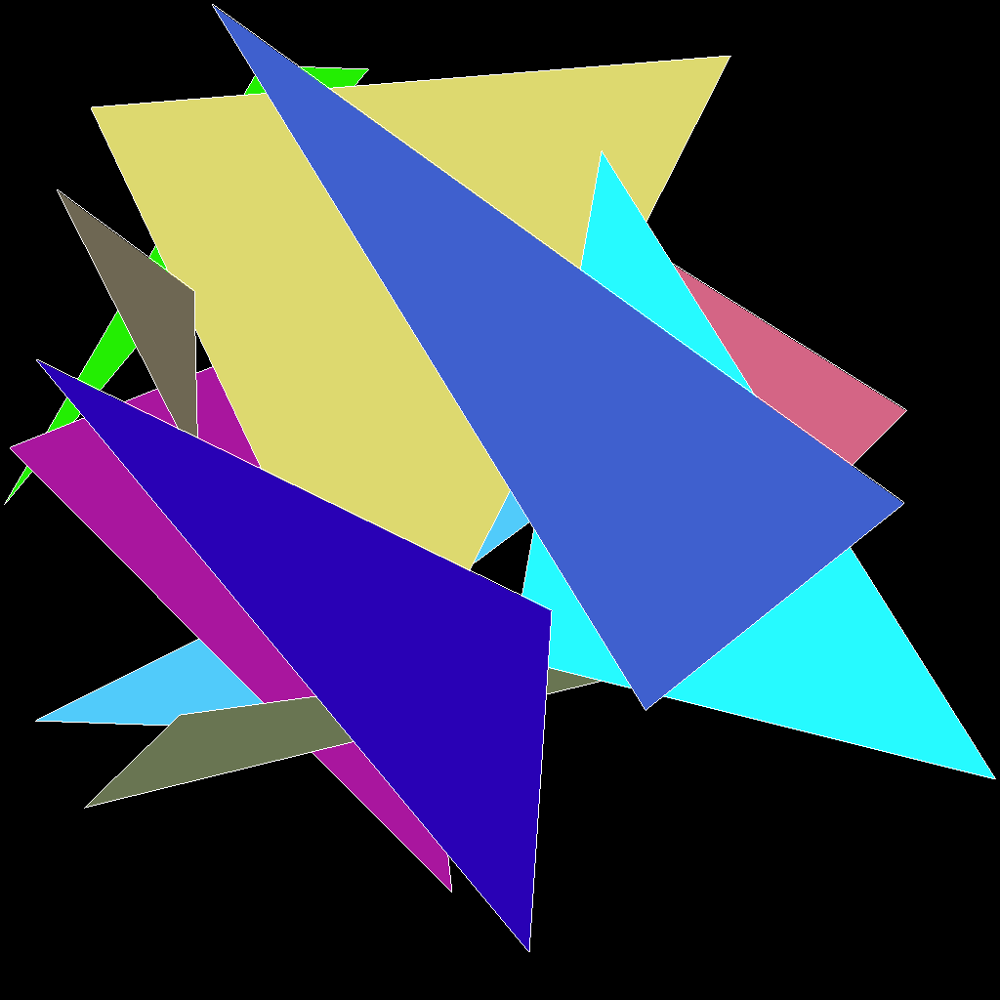

# TinyRaster






## A small custom software rasterizer built from scratch using C++

### Features
- A custom implementation for **framebuffer** which supports **clearing framebuffer with a color**, **point plotting on framebuffer**
- Supports **Line Rasterization**
- Supports **Triangle Rasterization**
- Supports **Vertex Attribute Interpolation**.
- Output is directly written to a PPM file

### Further Developments
- Working on more features for making it into a **full-fledged software renderer**

## Running TinyRaster
```
git clone https://github.com/AayushBade14/TinyRaster.git
cd TinyRaster
mkdir Build
cd Build
cmake ..
```

### Debug Build
```
cmake -S ../ -B . -DCMAKE_BUILD_TYPE=DEBUG
cmake --build .
```

### Release Build
```
cmake -S ../ -B . -DCMAKE_BUILD_TYPE=Release
cmake --build .
```
## Run
```
./tr
```
